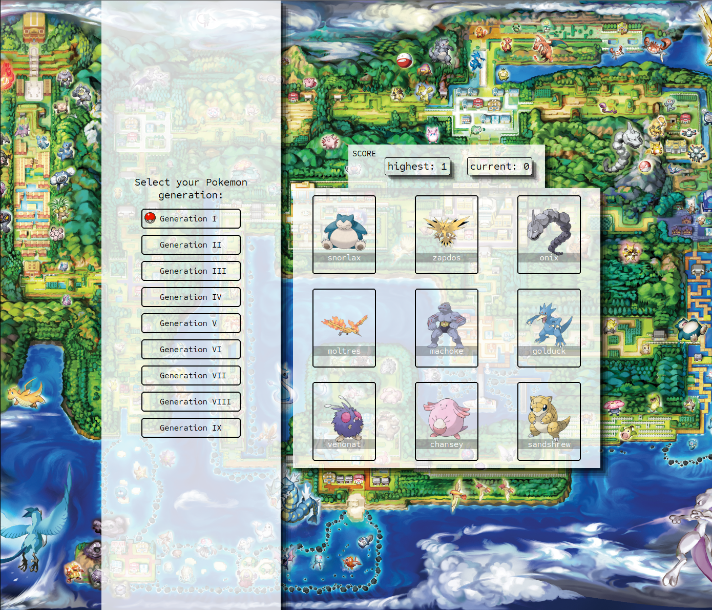

# Memory Card Game

Playing memory card with pokemon! Select your favorite pokemon generation and start to play. Keep track of your highest score while change generations, and take a look on the background and feel nostalgic!

The main goal of this project was to learn how to use hooksto manage and utilize state while fetching and using data from an external API (PokéAPI).


This project was made following [The Odin Project](https://www.theodinproject.com/) lessons.

[Link to preview](https://keen-croquembouche-ec28e2.netlify.app/)

[](https://app.netlify.com/projects/keen-croquembouche-ec28e2/deploys)



## :hammer: Technologies

- [React](https://react.dev/)
- [PokéAPI](https://pokeapi.co/about) - to fetch pokemon data (name, sprite, ID)

## Installing

1. Clone this repository
```bash
$ git clone https://github.com/smkakitani/odin-memory-card.git
```

2. Go into the repository
```bash
$ cd odin-memory-card
```

3. Install dependecies and run the app
```bash
$ npm install 

# Run app
$ npm run dev
```